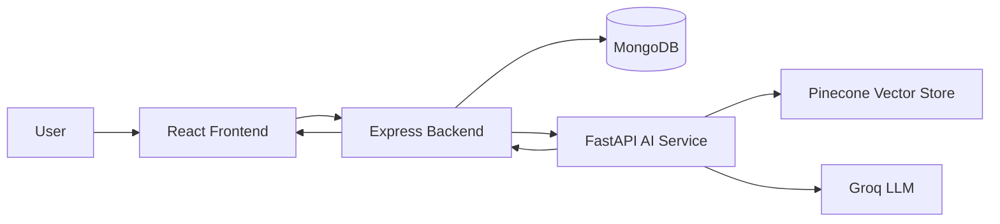

# RAG Medical Chatbot

A full-stack medical assistant that answers user questions with retrieval-augmented generation (RAG), chat history, and a clean React interface. The app is split into three layers:

- A React frontend for the chat UI
- An Express + MongoDB backend for chat/session storage
- A FastAPI + LangChain service that retrieves medical context from Pinecone and generates answers with Groq

## What this project does

RAG Medical Chatbot is built to help users ask medical questions in a conversational way. When a question is sent, the backend stores the message in MongoDB, forwards the prompt to the AI service, and then saves the assistant reply back into the same chat thread.

The AI service uses:

- Pinecone for semantic retrieval over the indexed medical knowledge base
- LangChain for retrieval and prompt orchestration
- Groq as the chat model provider

If the answer is not supported by the retrieved context, the model is instructed to say so instead of guessing.

## How it works



1. The user opens the chat UI and starts a new conversation.
2. The frontend sends the question to the Express backend.
3. The backend stores the user message in MongoDB.
4. The backend calls the FastAPI AI service.
5. The AI service retrieves relevant medical chunks from Pinecone.
6. Groq generates a grounded answer using the retrieved context.
7. The backend stores the assistant response and updates the chat title on the first message.
8. The frontend refreshes the conversation list and renders the reply.

## Features

- Medical question answering with RAG
- Persistent chat history per conversation
- Automatic chat title generation
- Sidebar with previous chats
- Clean, responsive chat interface
- Separate AI service for retrieval and generation logic

## Tech Stack

- Frontend: React, Vite, Axios
- Backend: Node.js, Express, MongoDB, Mongoose, Axios, CORS
- AI Service: FastAPI, LangChain, Pinecone, Groq, Python

## Project Structure

```text
RAG-medibot/
├── frontend/       # React UI
├── backend/        # Express API + MongoDB models
├── ai-service/     # FastAPI RAG service and indexing scripts
├── docs/           # Project docs
└── scripts/        # Utility scripts
```

## Prerequisites

Make sure you have the following installed:

- Node.js 18 or newer
- Python 3.10 or newer
- MongoDB running locally or in the cloud
- A Pinecone account and index
- A Groq API key

## Installation

### 1) Clone the repository

```bash
git clone <your-repo-url>
cd RAG-medibot
```

### 2) Set up the backend

```bash
cd backend
npm install
```

Create a `.env` file inside `backend/`:

```env
MONGO_URL=your_mongodb_connection_string
```

### 3) Set up the AI service

```bash
cd ../ai-service
python -m venv .venv
```

Activate the virtual environment:

- Windows PowerShell: `.venv\Scripts\Activate.ps1`
- Command Prompt: `.venv\Scripts\activate.bat`
- macOS/Linux: `source .venv/bin/activate`

Install Python dependencies:

```bash
pip install -r requirements.txt
```

Create a `.env` file inside `ai-service/`:

```env
PINECONE_API_KEY=your_pinecone_api_key
GROQ_API_KEY=your_groq_api_key
```

If you need to build the Pinecone knowledge base from the local data folder, run the indexing script first:

```bash
python store_index.py
```

### 4) Set up the frontend

```bash
cd ../frontend
npm install
```

## Running the project

Open three terminals and start each service separately.

### Backend

```bash
cd backend
node server.js
```

The backend runs on `http://localhost:8080`.

### AI service

```bash
cd ai-service
uvicorn app:app --reload --port 8000
```

The FastAPI service runs on `http://127.0.0.1:8000`.

### Frontend

```bash
cd frontend
npm run dev
```

The frontend runs on `http://localhost:5173`.

## API Flow

- `POST /api/ai/createNewChat` creates a new chat thread
- `GET /api/ai/getChats` returns all saved chats
- `GET /api/ai/getOldChats/:id` returns the messages for one chat
- `POST /api/ai/ask-ai` sends a question to the AI service and stores the answer
- `POST /api/ai-service/data` is the FastAPI RAG endpoint used by the backend

## Demo Video

Place your demo video in `videos/demo.mp4` and GitHub will be able to render it from the repository.

<video controls width="100%">
	<source src="videos/demo.mp4" type="video/mp4">
	Your browser does not support the video tag.
</video>

If GitHub does not render the video inline for your repo view, use the same relative path as a normal link:

- [Demo Video](videos/demo.mp4)

## Notes

- The medical assistant is meant for informational use and should not be treated as a substitute for professional medical advice.
- The AI answer quality depends on the indexed knowledge base, the Pinecone index, and the configured Groq model.
- If chat history is missing, check that MongoDB is running and that the backend is connected successfully.

## Author

Sahid Ahmed
